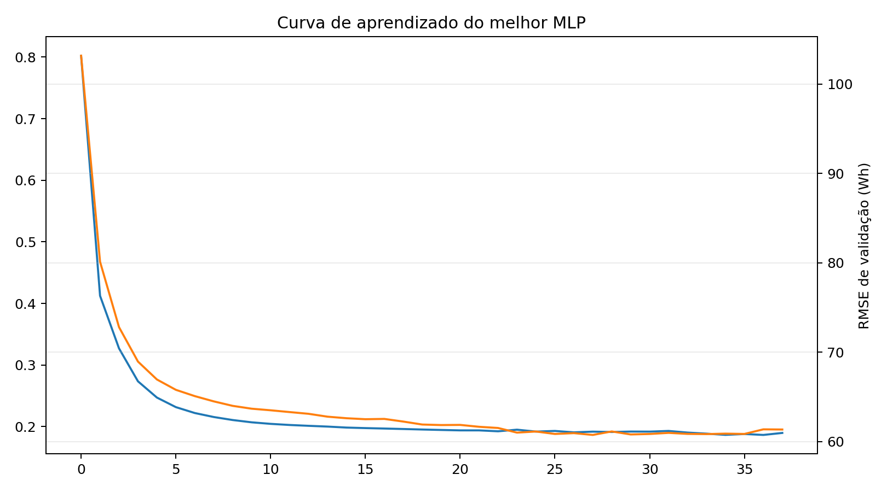
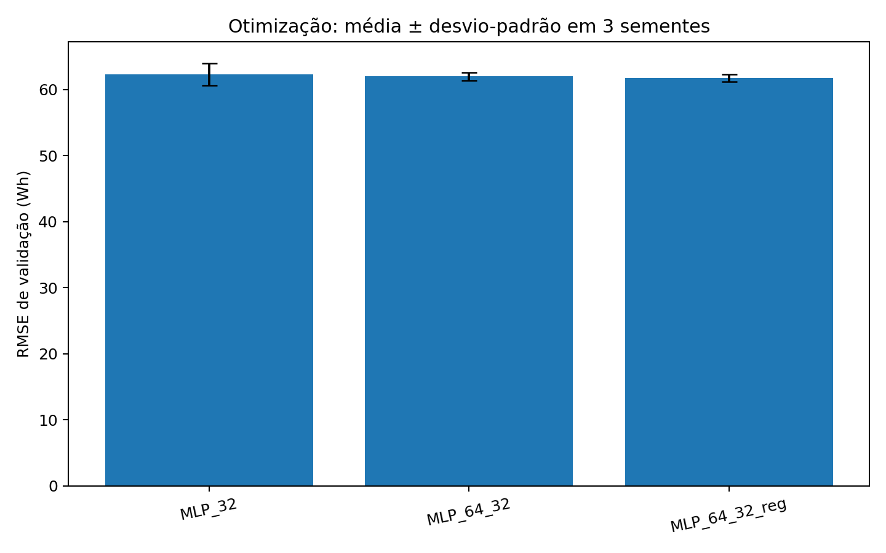
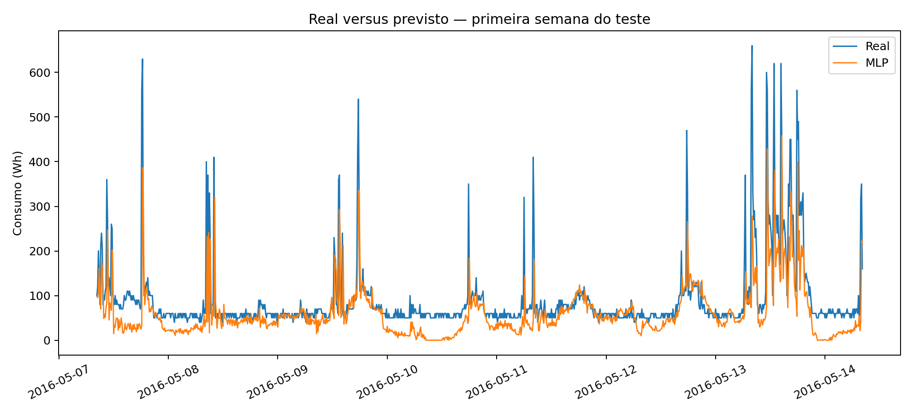

# Relatório breve — Predição de energia com MLP

## Objetivo

Prever o consumo de eletrodomésticos **10 minutos à frente** na residência de
baixo consumo energético estudada por Candanedo, Feldheim e Deramaix (2017).

## Protocolo

- Série ordenada no tempo e transformada em problema supervisionado.
- Defasagens de consumo de 10 min, 1 h, 2 h e 24 h, médias móveis e variáveis cíclicas.
- Divisão cronológica: 13713 treino, 2938 validação
  e 2939 teste.
- Padronização aprendida exclusivamente no treino.
- Três arquiteturas, três sementes por arquitetura e early stopping pela validação.
- Teste consultado uma única vez depois da seleção.

## Resultados

| Modelo | MAE (Wh) | RMSE (Wh) | R² |
|---|---:|---:|---:|
| MLP selecionada | 37.98 | 69.61 | 0.415 |
| Persistência | 26.72 | 66.79 | 0.461 |

A arquitetura escolhida na validação foi **MLP_32**,
com semente 42 e melhor época
28. O tempo total foi
9.2 segundos.

No teste, a persistência foi superior à MLP nas três métricas. Isso é um resultado
negativo, porém cientificamente relevante: em horizonte tão curto, o consumo atual
é uma referência extremamente forte, e a maior complexidade da rede não garantiu
melhor generalização para o trecho cronológico mais recente.

## Análise crítica e paralelo com o artigo

O artigo original avaliou modelos orientados a dados — regressão linear, SVR,
random forest e gradient boosting — e enfatizou seleção/importância de variáveis.
Ele não apresentou uma MLP como modelo central. Assim, este trabalho **reproduz o
problema, os dados, o alvo e as métricas**, mas adapta a técnica para a MLP exigida
pelo Grupo B.

A principal diferença metodológica é temporal: esta versão prevê o próximo
intervalo e preserva a ordem cronológica. Isso evita que observações futuras
influenciem o treinamento, mas também torna os números incompatíveis com uma
comparação direta com resultados obtidos por partições aleatórias. As defasagens
dão memória explícita a uma rede feedforward, que, ao contrário de uma LSTM, não
mantém estado temporal interno.

## Limitações

Os dados representam uma única residência e cerca de 4,5 meses. Logo, não se pode
afirmar generalização para outras casas, estações ou perfis familiares. Picos de
consumo são raros e elevam o RMSE. Novos estudos deveriam usar validação walk-forward,
intervalos de confiança e dados de outras residências.

## Figuras

